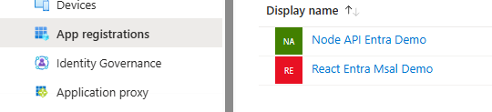
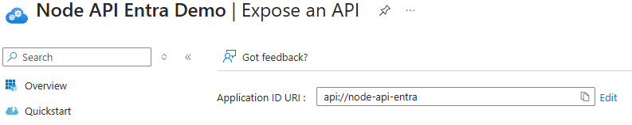
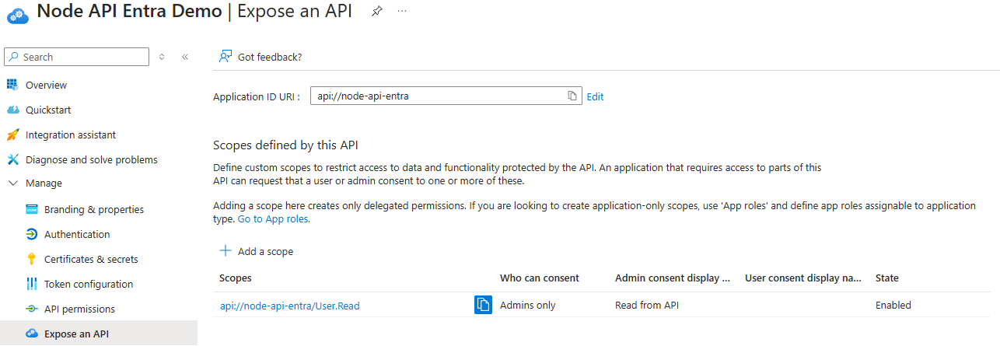
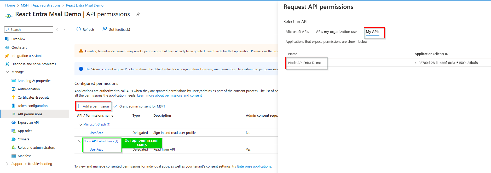

# Node API Entra Demo

## Prerequisites
For this demo you will need:
- An API registered within Entra and for it to have at least one scope exposed
- The API identifier for the above
- An SPA application registration which has API permissions setup

## To configure the demo API
Once you have downloaded the demo application open the `.env` file to update the environment variables to be able to connect to your Entra application registration.
```dotenv
API_TENANT_ID=your-tenant-id
API_IDENTIFIER=api://your-api-identifier
```

## How to setup an API in Entra
First you will need to register a new application in your Entra App registrations.

*For demo purposes we have created a Node API Entra Demo registration*

### Application Id URI
The first time you create a scope in the below steps, Entra will ask you to define an Application Id URI. This is the `api-identifier` we will use to configure our environment variables above.

*For demo purposes we have used "node-api-entra", you can name it whatever you find most suitable*

### Create an API Scope
To enable our API to be available to other applications in our Entra tenancy we need to first create a scope and expose it. To do so go to **Expose an API** in the Entra application registration for your API. Then select **Add a scope**

*For demo purposes we have named our scope read from an API and made it Admins only. You can read more on scopes here on the [AuthO website](https://auth0.com/docs/get-started/apis/scopes/api-scopes)*

### Using the API in your front end application
To use allow your front end application to have permissions to use your API you need to configure your front end apps Entra application registration. Open your front end application registration in Entra and then open API permissions. From there select **Add a permission** -> **My APIs** -> Select your API.


## To run the demo API locally
If would like just to run the Node API, open a terminal in the `node-api-entra` directory and run the below:
```bash
npm install
npm run dev
```
The API is secured via the Entra API registration so for the purposes of the demo you will need to use the `react-entra-msal` front end client React application. This can be achieved by configuring both and running them locally or by utilising the `docker-compose` file in the `react-node-docker-compose` directory.

There is a _status endpoint configured at `https://localhost:4000/api/_status` if you would like to check the API is up and running without the front-end application.

## To run the demo API using docker
To run the Node API in a docker container you can follow the steps below.
If you are using Windows make sure you have Docker Desktop installed and the engine is running before continuing.

First update the environment variables in the dockerfile
```
# Add environment variables
ENV API_TENANT_ID=your-tenant-id
ENV API_IDENTIFIER=api://your-api-id
```

Open a bash terminal in the same directory as the dockerfile and run the below to build the image:
```bash
docker build -t node-api-entra .
```

Once the image has built run the below to start the React dev server within your docker container:
```bash
docker run -p 4000:4000 node-api-entra
```
Once the docker container is running it will be available on port 4000 and you can use the front end application to access it. You can also use the `https://localhost:4000/api/_status` to check the API is running.

# How to create a Node API with Entra authorisation
 
## Initialise node api
First create a directory to install your api into and then run the below:
```bash
npm init -y
```
This will create the package.json file to track installed node packages.

## Install basic packages
To allow our node project to work as an API we need the below packages:
```bash
npm install express cors dotenv
```

### Express.js
`Express.js` is a minimal and flexible Node.js back end web application framework for building RESTful APIs with Node. Some key features of express include:
1. **Middleware support** which has access to request (`req`) and response (`res`) objects and allow encapsulation of shared logic across multiple endpoints in a single place.
2. **Routing** for HTTP methods and URL paths to help define the structure of your API in simple modular route handlers.
3. **Static file serving** for files such as images, CSS and JavaScript to serve front-end assessts without additional configuration.
4. **Minimal and unopinionated**, `Express.js` doesn't enforce strict structures or dependencies offering flexibility for small to large scale applications.

### cors
CORS stands for Cross-Origin Resource Sharing. It's a mechanism that allows a server to indicate from which origins (domains) a browser should allow loading resources. It is a security standard that helps web servers control which websites can access their resources, ensuring a more secure web experience.

#### Configuring CORS
- Allow Specific Origins
```javascript
app.use(cors({
  origin: 'http://example.com'
}));
```
- Or allow multiple origins
```javascript
const allowedOrigins = ['http://localhost:3000', 'https://myapp.com'];

app.use(cors({
  origin: (origin, callback) => {
    if (!origin || allowedOrigins.includes(origin)) {
      return callback(null, true);
    }
    return callback(new Error('Not allowed by CORS'));
  }
}));
```

### dotenv
The node `dotenv` is a zero dependency package which allows us to manage environment variables. `dotenv` loads environment variables from a `.env` file into `process.env` giving us flexibility over the configuration of the API.

#### example `.env` file
```dotenv
PORT=3000
DB_HOST=localhost
```

#### Loading the environment variables
```javascript
require('dotenv').config();

const databaseHost = process.env.DB_HOST; //localhost
```

## Install Authorisation packages
To allow us to integrate our API with Entra we need to extend its functionality with the below packages:
```bash
npm install express-jwt jwks-rsa jsonwebtoken
```

### express-jwt
This is a middleware for `Express.js` that validates JWTs ([JSON Web Tokens](https://jwt.io/introduction)) and sets the req.user property with the decoded token if the verification is successful. This enables route handlers to then access the data in the token if it is valid.

### jwks-rsa
`jwks-rsa` is a library that retrieves and caches public signing keys from a JWKS endpoint. These keys are used to verify JWTs signed with asymmetric algorithms like RS256. It works with `express-jwt` to support JWT validation using **JSON Web Key Sets (JWKS)**

#### Quick Context:
JWTs can be signed using:
- Symmetric algorithms (like HS256) – use the same secret for signing and verification.
- Asymmetric algorithms (like RS256) – use a private key to sign and a public key to verify.

If you're using RS256, you don’t store the public key locally. Instead, you fetch it dynamically from a JWKS endpoint, and that's where jwks-rsa comes in.

### jsonwebtoken
`jsonwebtoken` provides a rich set of features for interacting with JWTs including:
- Sign (create) JWTs
- Verify JWTs
- Decode JWTs

## Setup the basic API
Create an index.js file to serve the API functionality:
```javascript
// index.js
require('dotenv').config();
const express = require('express');
const jwt = require('express-jwt');
const jwks = require('jwks-rsa');
const cors = require('cors');

const app = express();
app.use(cors());

const checkJwt = jwt.expressjwt({
    secret: jwks.expressJwtSecret({
        cache: true,
        rateLimit: true,
        jwksRequestsPerMinute: 5,
        jwksUri: `https://login.microsoftonline.com/${process.env.API_TENANT_ID}/discovery/v2.0/keys`,
    }),
    audience: process.env.API_IDENTIFIER,
    issuer: `https://login.microsoftonline.com/${process.env.API_TENANT_ID}/v2.0`,
    algorithms: ['RS256'],
});

app.get('/api/protected', checkJwt, (req, res) => {
    res.json({ message: 'You accessed a protected API route!', user: req.auth });
});

app.listen(4000, () => {
    console.log('API running on http://localhost:4000');
});
```

## Create a `.env` file
In your api directory create the below `.env` file:
```dotenv
API_TENANT_ID=your-tenant-id
API_IDENTIFIER=api://your-api-client-id
```

## Security tips to extend the API functionality
✅ Use HTTPS in production

✅ Set up CORS properly - define the correct allowed origins

## Running the API