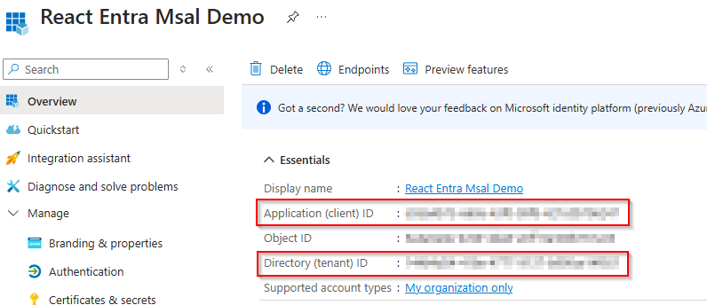
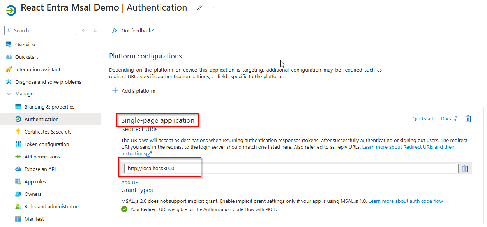
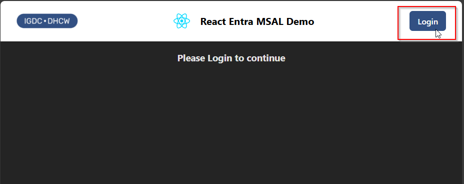

# React Entra MSAL (Microsoft Autenthication Library) demo

This application demonstrates the requirements for a React app to utilise an Entra application registration using an authorisation code flow with PKCE [(proof key for code exchange)](https://auth0.com/docs/get-started/authentication-and-authorization-flow/authorization-code-flow-with-pkce)

## Prerequisites
Before getting started with the demo you will need:
- A client Id and tenant Id for an Entra application registration
- NPM or a similar package manager if you intend to run the demo application natively
- Docker if you intend to utilise the docker files to run the demo application in a container

## To configure the demo app
Once you have downloaded the demo application open the `.env` file to update the environment variables to be able to connect to your Entra application registration.
```dotenv
VITE_APP_CLIENT_ID=your-client-id-here
VITE_APP_TENANT_ID=https://login.microsoftonline.com/your-tenant-id-here
VITE_APP_REDIRECT_URI=http://localhost:3000
```

*For the standalone demo we don't need to worry about the API environment variables*

### Client Id and TenantId
You can find your Client Id and Tenant Id in the overview page of your Entra application registration.



### Redirect URI
This must be configured in the Application Registration -> Authentication page:*
- Platform=`SPA`
- Redirect URI = `http://localhost:3000`



*We are using port 3000 for the demo but you can configure this as needed*

## To run the demo app locally
If would like just to run the React client application, open a terminal in the `react-entra-msal` directory and run the below:
```bash
npm install
npm run dev
```
Once the development server is running a browser should be launched to take you to the demo application. If not open `http://localhost/:3000` in your browser.

## To run the demo app using Docker
To run the React client application in a docker container you can follow the steps below.
If you are using Windows make sure you have Docker Desktop installed and the engine is running before continuing.

Open a bash terminal in the same directory as the dockerfile and run the below to build the image:
```bash
docker build -t react-entra-msal .
```

Once the image has built run the below to start the React dev server within your docker container:
```bash
docker run -p 3000:80 react-entra-msal
```
Once the development server is running open `http://localhost/:3000` in your browser to view the application.

*This is binding the external port 3000 to the default nginx port 80 within the container*

## Signin via Entra once the app is running
Now that the app is running you can use the login button in the top right to sign in via Entra.



Once you have signed in you should be shown the Todo app functionality. Without an API this Todo app is quite limited as it doesn't have any state management so a refresh will clear all of the Todo items.

## Connecting an API
The recommended API to use for this demo is the one from the **node-api-entra** demo as it has the required endpoints to extend the Todo functionality. 

Once you have setup the API in Entra and its environment variables you can update the `.env` for the React front-end:
```dotenv
VITE_APP_TODO_API_URI=http://localhost:4000/api
VITE_APP_USING_API=true
VITE_APP_API_IDENTIFIER=api://your-api-identifier
```

#### VITE_APP_API_IDENTIFIER
This should match the API identifier of the Node API, see the **node-api-entra** demo for more information.

### Running the app with the API
After updating these environment variables appropriately it is recommended you restart the React dev server - in the terminal running the React dev server press `ctrl+c` and then run:
```bash
npm run dev
```

With the `VITE_APP_USING_API` set to `true` make sure the Node API is running or you will encounter errors. Assuming is all correct now when you add, delete or complete a Todo item the application will send a token to the API along with a request and the API will maintain the state of the Todos. The React app will also use the `useEffect` hook to fetch all Todo items once again passing a token to authorise the request.

Now we have the API connected it will manage our Todo items state. This means that when the React app renders it can call the API to fetch the Todo items, a refresh will no longer mean we lose all of our Todo items.

### TodoService `getAccessToken`
The below method in our TodoService is responsible for acquiring an access token for the signed in user.

#### `acquireTokenSilent`
This call will attempt to acquire the token without interrupting the user. If the user has not authorised the use of the token. the MSAL object `instance` will throw an error.

#### `InteractionRequiredAuthError`
If this error is thrown then the app will catch it and launch a popup to ask the user to authorise the use of the token to fetch data from the API.

```javascript
// serices/todoService.jas
export const getAccessToken = async (instance, account, scope) => {
  try {
    const response = await instance.acquireTokenSilent({
      scopes: [scope],
      account,
    });
    return response.accessToken;
  } catch (error) {
    if (error instanceof InteractionRequiredAuthError) {
      const response = await instance.acquireTokenPopup({ scopes: [scope] });
      return response.accessToken;
    } else {
      console.error("Token acquisition failed:", error);
      throw error;
    }
  }
};
```

### TodoService passing the access token in `apiCall` method
In the TodoService is a generic apiCall method we use the access token from the `getAccessToken` method in our http request. It is passed in as a **Bearer** token as shown below:
```javascript
  const headers = {
    'Content-Type': 'application/json',
    Authorization: `Bearer ${token}`,
  };
```
Without this token the API would return a `401 Unauthorized` error and the application would be unable to utilise the Todo functionality.

# Building a React Application with MSAL

### Creating the initial react application
For this demo application we are using Vite to create our vanilla React application.

```bash
npm create vite@latest react-entra-msal react-entra-msal -- --template react
cd react-entra-msal
npm install
```

### Install the MSAL package
```bash
npm install @azure/msal-browser @azure/msal-react
```

❗You may find that the MSAL package throws an error during install if your current React version is greater than React 18. 
To resolve this error you can rollback your React version with the below script:

```bash
npm install react@18 react-dom@18
```

### Add a .env file
In the root of the newly created React project create a (or open your) `.env` file and add the below:
```dotenv
VITE_APP_CLIENT_ID=your-client-id-here
VITE_APP_TENANT_ID=https://login.microsoftonline.com/your-tenant-id-here
VITE_APP_REDIRECT_URI=http://localhost:3000 #adjust this if needed
```
*As we are using Vite it is important that the environment variables start with `VITE_`*

### Setup the Authentication provider
In the src folder create an `authConfig.js` file.
```javascript
// src/authConfig.js
export const msalConfig = {
    auth: {
      clientId: import.meta.env.VITE_APP_CLIENT_ID,
      authority: import.meta.env.VITE_APP_AUTHORITY,
      redirectUri: import.meta.env.VITE_APP_REDIRECT_URI,
    },
    cache: {
      cacheLocation: "localStorage",
      storeAuthStateInCookie: false,
    },
  };

  export const loginRequest = {
    scopes: ["User.Read"],
};
```

Then you need to wrap your React application with the MSAL provider in the `main.jsx` file. This imports the configuration from the previous step into the MSAL provider and give the React app access to the MSAL functionality.
```javascript
// src/main.jsx
import { StrictMode } from 'react'
import { createRoot } from 'react-dom/client'
import './index.css'
import App from './App.jsx'
import { PublicClientApplication } from '@azure/msal-browser'
import { MsalProvider } from '@azure/msal-react'
import { msalConfig } from './authConfig.js'

const msalInstance = new PublicClientApplication(msalConfig);

async function startApp() {
    await msalInstance.initialize();

    createRoot(document.getElementById('root')).render(
        <StrictMode>
            <MsalProvider instance={msalInstance}>
                <App />
            </MsalProvider>
        </StrictMode>,
        );
}

startApp();
```

### Add Authentication logic
 We can now use React hooks from the MSAL package to import authentication functionality.
 ```javascript
 // src/App.jsx 
import './App.css'
import { useMsal, useIsAuthenticated } from '@azure/msal-react'
import { loginRequest } from './authConfig'

const App = () => {
  const { instance } = useMsal();
  const isAuthenticated = useIsAuthenticated();

  const handleLogin = () => {
    instance.loginPopup(loginRequest).catch((e) => {
      console.error(e);
    });
  };

  const handleLogout = () => {
    instance.logoutPopup();
  };

  return (
    <>
      <div>
        <h1>Welcome to Entra Auth App</h1>
        {!isAuthenticated ? (
          <button onClick={handleLogin}>Login</button>
        ) : (
          <>
            <p>You are logged in!</p>
            <button onClick={handleLogout}>Logout</button>
          </>
        )}
      </div>
    </>
  )
}

export default App;
 ```

 #### useMsal
 For our demo application we are going to utilise the instance from the `useMsal` hook. This contains login and logout methods which will use the MSAL configuration to connect to Entra and handle the authentication process for us.

 *It is worth noting that we are using instance.loginPopup and instance.logoutPopup, this will launch the authentication in a popup box. We can also use instance.loginRedirect and instance.logoutRedirect to redirect the user to an authentication page without the popup*

 #### useIsAuthenticated
 React MSAL uses the `useIsAuthenticated` hook to track a user's authentication state. By pulling `isAuthenticated` out of the hook we can then use that to dynamically render content based on the users authentication state.

 ### Test the application!
 At this point you can run the development server and test the authentication functionality. After launching the below script the app should load in a browser. 
 ```bash
npm run dev
 ```
Now pressing the Login button should show the login dialog and allow you to choose an account to sign in with. 

Once you return to the app the logout button should now be rendered in place of the login button. Pressing the logout button will show a dialog to allow you to choose an account to sign out.
